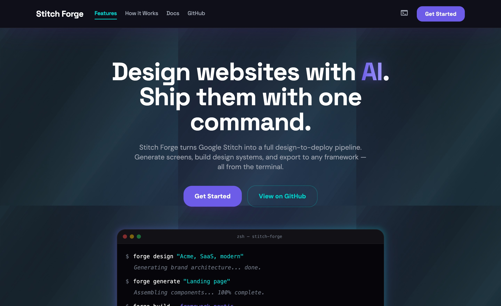

# Design Guard

[English](README.md) | [Español](README.es.md)

<p align="center">
  <strong>Diseña sitios web con IA. Publicalos con un comando.</strong>
</p>

<p align="center">
  <em>Design Guard convierte Google Stitch en un pipeline completo de diseño a deploy.<br>
  Genera pantallas, construye sistemas de diseño y exporta a tu framework favorito — todo desde la terminal.</em>
</p>

<p align="center">
  
  
  
  
  
  
  
  <a href="https://www.npmjs.com/package/design-guard"></a>
</p>

---

<p align="center">
  
</p>

<p align="center"><em>Esta landing page fue generada por Design Guard usando el pipeline completo. <a href="https://freptar0.github.io/design-guard/">Demo en vivo</a> · <a href=".github/assets/full-landing.jpg">Screenshot completo</a></em></p>

---

## Que es esto

Design Guard envuelve la API MCP de Google Stitch en un framework CLI que maneja el ciclo completo de diseño web generado por IA:

- **Investiga tu negocio** y genera un sistema de diseño a medida — el Agente de Inteligencia de Diseño entiende tu modelo de negocio antes de diseñar
- **Crea pantallas** con prompts guiados, validacion anti-slop y guardrails integrados
- **Previsualizacion instantanea** en tu navegador o directamente en Claude Code
- **Compila y exporta** a HTML estatico, Astro o Next.js
- **Rastrea tu cuota** y mantente dentro de los limites mensuales de Stitch
- **Auto-investigacion** de actualizaciones de Stitch para que tus herramientas nunca se queden obsoletas

> **Hecho para Claude Code.** Design Guard incluye 7 skills que convierten a Claude en tu copiloto de diseño. Genera un sitio web completo sin salir de la conversacion.

## Funcionalidades

| Funcionalidad | Descripcion |
|---------------|-------------|
| **Agente de Inteligencia de Diseño** | Investiga tu negocio, analiza competidores, entiende tu audiencia y genera un DESIGN.md a medida — no boilerplate |
| **Conciencia de Modelo de Negocio** | Detecta si eres retail fisico, e-commerce, SaaS o servicio — previene generar patrones de pagina incorrectos |
| **Generador de DESIGN.md** | Especificacion de 8 secciones con validacion estricta (colores hex, tamaños rem, patrones, reglas anti-slop) |
| **Constructor de Prompts** | Framework zoom-out-zoom-in con guardrails: longitud, una pantalla, deteccion de vaguedad, alineacion de negocio |
| **Validacion Anti-Slop** | Puntua HTML generado 0-100, detecta fuentes AI-default, gradientes purple-blue, jerarquia de headings |
| **Build Multi-Framework** | Exporta a HTML estatico, Astro (via Stitch MCP) o Next.js App Router — con firma de Design Guard |
| **Preview en Vivo** | Abre pantallas en el navegador desde CLI, TUI, o visualiza inline en Claude Code |
| **TUI Interactiva** | Dashboard, compositor de prompts y editor de diseño — todo en la terminal |
| **Rastreo de Cuota** | Medidor visual para Flash (350/mes) y Pro (200/mes) |
| **Auto-Investigacion** | Rastrea docs, blog y foros de Stitch — compara contra estado conocido, actualiza base de conocimiento |
| **Resiliencia del Cliente MCP** | Reintentos con backoff exponencial, timeouts 30s/120s, mensajes de error amigables |

## Inicio Rapido

```bash
# Instalar globalmente
npm i -g design-guard

# O usar sin instalar
npx design-guard init

# Configurar
# Agrega tu STITCH_API_KEY de stitch.withgoogle.com > Settings > API Key

# Inicializar proyecto
dg init

# Investigar tu negocio y generar un sistema de diseño a medida
dg discover "Tu Empresa, industria, audiencia, estetica" --url https://tusitio.com

# Generar tu primera pantalla
dg generate "Landing page con hero, features y CTA"

# Previsualizarla
dg preview

# Compilar el sitio
dg build --framework static --auto
```

### Desde el Codigo Fuente

```bash
git clone https://github.com/FReptar0/design-guard.git
cd design-guard && npm install
cp .env.example .env  # Agrega tu STITCH_API_KEY
npm run build
npm link  # Hace disponible el comando `dg` globalmente
```

## Como Funciona

```
Nombre del negocio o brief
│
▼
┌──────────────────────┐
│  Agente de           │  Investiga modelo de negocio, analiza sitio,
│  Inteligencia        │  estudia competidores, entiende audiencia
└────────┬─────────────┘
         │
┌────────▼─────────────┐
│  DESIGN.md           │  Sistema de diseño de 8 secciones + contexto de negocio
│  (con contexto biz)  │  "NO es e-commerce — genera trafico a tiendas"
└────────┬─────────────┘
         │
┌────────▼─────────────┐
│  Constructor de      │  Guardrails: longitud, una pantalla,
│  Prompts + MCP       │  deteccion vaga, alineacion de negocio
└────────┬─────────────┘
         │
    ┌────┼────┐
    ▼    ▼    ▼
 Pantalla Preview Cuota
 .html   navegador tracker
    │
┌───▼──────────────────┐
│  Build Framework     │  --framework static | astro | nextjs
│  + Firma Guard       │  <!-- Built with Design Guard -->
└──────────────────────┘
```

## Uso

### Comandos CLI

```
dg init                              Configurar proyecto, auth y MCP
dg discover "brief..." [--url URL]  Investigar negocio + generar DESIGN.md
dg design "brief..."                Generar DESIGN.md desde brief (modo preset)
dg generate "descripcion..."        Generar pantalla via Stitch
dg preview [nombre-pantalla]        Abrir pantalla en navegador (--all para todas)
dg build --framework static         Compilar sitio (static | astro | nextjs)
dg sync [project-id]                Sincronizar pantallas desde Stitch
dg research                         Verificar actualizaciones de la API de Stitch
dg workflow [redesign|new-app]      Mostrar workflow guiado paso a paso
dg quota                            Mostrar uso de cuota de generacion
dg tui                              Lanzar interfaz interactiva de terminal
```

### Skills para Claude Code

```
/dg-discover   → Investigar negocio + generar DESIGN.md a medida (recomendado)
/dg-design     → Generar DESIGN.md desde un brief (modo preset)
/dg-generate   → Generar pantallas con prompts guiados + guardrails
/dg-build      → Compilar y exportar al framework elegido
/dg-preview    → Previsualizar pantallas inline (imagen base64 via MCP)
/dg-research   → Verificar actualizaciones de Stitch
/dg-sync       → Sincronizar desde un proyecto de Stitch
```

## Configuracion MCP

Design Guard se conecta a Google Stitch via MCP. Agrega esto a tu `.mcp.json`:

```json
{
  "mcpServers": {
    "stitch": {
      "command": "npx",
      "args": ["@_davideast/stitch-mcp", "proxy"],
      "env": { "STITCH_API_KEY": "${STITCH_API_KEY}" }
    }
  }
}
```

O conecta directamente a la API de Stitch:

```json
{
  "mcpServers": {
    "stitch": {
      "type": "http",
      "url": "https://stitch.googleapis.com/mcp",
      "headers": { "X-Goog-Api-Key": "${STITCH_API_KEY}" }
    }
  }
}
```

> `dg init` crea este archivo automaticamente.

## Estructura del Proyecto

```
design-guard/
├── src/
│   ├── index.ts              # Entrada CLI (commander)
│   ├── commands/             # init, discover, design, generate, build, sync, research, preview
│   ├── adapters/             # Adaptadores de framework (static, astro, nextjs) + firma Design Guard
│   ├── tui/                  # Terminal UI con Ink (Dashboard, PromptBuilder, DesignEditor)
│   ├── mcp/                  # Cliente MCP con retry, timeout, parsing de respuesta
│   ├── research/             # Investigador de negocios, sintetizador de diseño, crawler, cache
│   ├── templates/            # DESIGN.md (14 industrias × 6 esteticas), prompts, workflows
│   └── utils/                # Config, validadores, prompt enhancer, output validator, cuota
├── tests/                    # 121 tests — unitarios + integracion con fixtures
├── .claude/skills/           # 7 skills para Claude Code (discover, design, generate, build, preview, research, sync)
├── docs/                     # Guia de diseño, guia de prompts, estado conocido
└── .github/workflows/        # CI (typecheck + tests)
```

## Desarrollo

```bash
npm install           # Instalar dependencias
npm run dev           # Lanzar TUI en modo desarrollo
npm test              # Ejecutar tests (modo watch)
npm run test:run      # Ejecutar tests una vez (121 tests)
npm run typecheck     # Verificar tipos sin compilar
npm run build         # Compilar TypeScript a dist/
```

## Contribuir

Consulta [CONTRIBUTING.md](./CONTRIBUTING.md) para instrucciones de configuracion y lineamientos.

## Licencia

[MIT](./LICENSE)

## Autor

Creado por [Fernando Rodriguez Memije](https://fernandomemije.dev).

<p align="center">
  <a href="https://fernandomemije.dev"></a>
  <a href="https://www.linkedin.com/in/fernando-rm/"></a>
  <a href="https://github.com/FReptar0"></a>
  <a href="mailto:hi@fernandomemije.dev"></a>
</p>
