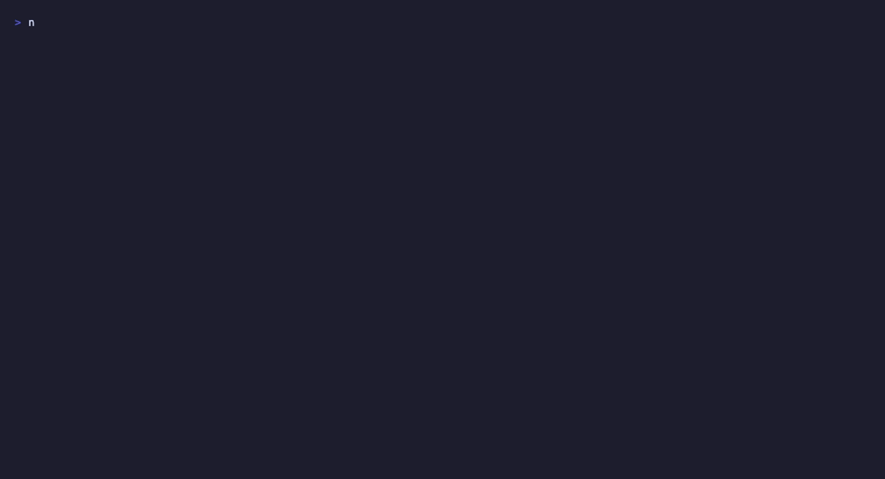

# Stitch Forge

[English](README.md) | [Español](README.es.md)

<p align="center">
  <strong>Diseña sitios web con IA. Publicalos con un comando.</strong>
</p>

<p align="center">
  <em>Stitch Forge convierte Google Stitch en un pipeline completo de diseño a deploy.<br>
  Genera pantallas, construye sistemas de diseño y exporta a tu framework favorito — todo desde la terminal.</em>
</p>

<p align="center">
  
  
  
  
  
  
  
</p>

---

<p align="center">
  
</p>

<p align="center"><em>Esta landing page fue generada por Stitch Forge en un solo prompt. <a href="https://freptar0.github.io/stitch-forge/">Demo en vivo</a> · <a href=".github/assets/full-landing.jpg">Screenshot completo</a></em></p>

---

## Que es esto

Stitch Forge envuelve la API MCP de Google Stitch en un framework CLI que maneja el ciclo completo de diseño web generado por IA:

- **Genera un sistema de diseño** a partir de un brief de marca — colores, fuentes, espaciado, componentes
- **Crea pantallas** con prompts guiados y guardrails integrados
- **Previsualizacion instantanea** en tu navegador o directamente en Claude Code
- **Compila y exporta** a HTML estatico, Astro o Next.js
- **Rastrea tu cuota** y mantente dentro de los limites mensuales de Stitch
- **Auto-investigacion** de actualizaciones de Stitch para que tus herramientas nunca se queden obsoletas

> **Hecho para Claude Code.** Stitch Forge incluye 6 slash commands que convierten a Claude en tu copiloto de diseño. Genera un sitio web completo sin salir de la conversacion.

## Funcionalidades

| Funcionalidad | Descripcion |
|---------------|-------------|
| **Generador de DESIGN.md** | Especificacion de sistema de diseño de 8 secciones con validacion estricta (colores hex, tamaños rem, patrones de componentes) |
| **Constructor de Prompts** | Framework zoom-out-zoom-in con guardrails: longitud maxima, una pantalla, sin solicitudes vagas |
| **Build Multi-Framework** | Exporta a HTML estatico, Astro (via Stitch MCP) o Next.js App Router |
| **Preview en Vivo** | Abre pantallas en el navegador desde CLI, TUI, o visualiza inline en Claude Code |
| **TUI Interactiva** | Dashboard, compositor de prompts y editor de diseño — todo en la terminal |
| **Rastreo de Cuota** | Medidor visual para Flash (350/mes) y Pro (50/mes) |
| **Auto-Investigacion** | Rastrea docs, blog y foros de Stitch — compara contra estado conocido, actualiza base de conocimiento |
| **Workflows Guiados** | Secuencias paso a paso para "rediseñar sitio existente" y "nueva app desde cero" |
| **Slash Commands para Claude Code** | `/forge-design`, `/forge-generate`, `/forge-build`, `/forge-preview`, `/forge-research`, `/forge-sync` |

## Inicio Rapido

```bash
# 1. Clonar e instalar
git clone https://github.com/FReptar0/stitch-forge.git
cd stitch-forge && npm install

# 2. Configurar
cp .env.example .env
# Agrega tu STITCH_API_KEY de stitch.withgoogle.com > Settings > API Key

# 3. Inicializar proyecto
npx tsx src/index.ts init

# 4. Crear un sistema de diseño
npx tsx src/index.ts design "Acme Corp, plataforma SaaS, startups, minimalista moderno"

# 5. Generar tu primera pantalla
npx tsx src/index.ts generate "Landing page con hero, grid de features y CTA"

# 6. Previsualizarla
npx tsx src/index.ts preview

# 7. Compilar el sitio
npx tsx src/index.ts build --framework static --auto
```

### Demo CLI

<p align="center">
  
</p>

## Como Funciona

```
Brief de marca o descripcion
│
▼
┌──────────────────┐
│   DESIGN.md      │  Sistema de diseño de 8 secciones (colores, fuentes, espaciado, patrones)
│   Generador      │
└────────┬─────────┘
         │
┌────────▼─────────┐
│  Constructor de   │  Guardrails: longitud, una pantalla, verificacion de especificidad
│  Prompts + MCP    │  → generate_screen_from_text
└────────┬─────────┘
         │
    ┌────┼────┐
    ▼    ▼    ▼
 Pantalla Preview Cuota
 .html   navegador tracker
    │
┌───▼──────────────┐
│  Build Framework  │  --framework static | astro | nextjs
└──────────────────┘
         │
    ┌────┼────┐
    ▼    ▼    ▼
  dist/  dist/  out/
  HTML   Astro  Next.js
```

## Uso

### Comandos CLI

```
forge init                          Configurar proyecto, auth y MCP
forge design "brief..."            Generar DESIGN.md desde brief de marca
forge generate "descripcion..."    Generar pantalla via Stitch
forge preview [nombre-pantalla]    Abrir pantalla en navegador (--all para todas)
forge build --framework static     Compilar sitio (static | astro | nextjs)
forge sync [project-id]            Sincronizar pantallas desde Stitch
forge research                     Verificar actualizaciones de la API de Stitch
forge workflow [redesign|new-app]  Mostrar workflow guiado paso a paso
forge quota                        Mostrar uso de cuota de generacion
forge tui                          Lanzar interfaz interactiva de terminal
```

### Slash Commands para Claude Code

```
/forge-design     → Generar DESIGN.md desde un brief de marca
/forge-generate   → Generar pantallas con prompts guiados
/forge-build      → Compilar y exportar al framework elegido
/forge-preview    → Previsualizar pantallas inline (imagen base64 via MCP)
/forge-research   → Verificar actualizaciones de Stitch
/forge-sync       → Sincronizar desde un proyecto de Stitch
```

## Configuracion MCP

Stitch Forge se conecta a Google Stitch via MCP. Agrega esto a tu `.mcp.json`:

```json
{
  "mcpServers": {
    "stitch": {
      "command": "npx",
      "args": ["@_davideast/stitch-mcp", "proxy"],
      "env": { "STITCH_API_KEY": "${STITCH_API_KEY}" }
    }
  }
}
```

> `forge init` crea este archivo automaticamente.

## Estructura del Proyecto

```
stitch-forge/
├── src/
│   ├── index.ts              # Entrada CLI (commander)
│   ├── commands/             # init, design, generate, build, sync, research, preview, workflow
│   ├── adapters/             # Adaptadores de framework (static, astro, nextjs)
│   ├── tui/                  # Terminal UI con Ink (Dashboard, PromptBuilder, DesignEditor)
│   ├── mcp/                  # Cliente MCP, constructores de tools, auth
│   ├── research/             # Crawler de actualizaciones de Stitch, differ, updater
│   ├── templates/            # Templates de DESIGN.md, prompts y workflows
│   └── utils/                # Config, logger, validadores, cuota, preview
├── tests/                    # Tests unitarios + integracion con fixtures
├── .claude/commands/         # Slash commands para Claude Code
├── docs/                     # Guia de diseño, guia de prompts, estado conocido
└── .github/workflows/        # CI (Node 20 + 22, typecheck + tests)
```

## Desarrollo

```bash
npm install           # Instalar dependencias
npm run dev           # Lanzar TUI en modo desarrollo
npm test              # Ejecutar tests (modo watch)
npm test -- --run     # Ejecutar tests una vez
npm run typecheck     # Verificar tipos sin compilar
npm run build         # Compilar TypeScript a dist/
```

## Contribuir

Consulta [CONTRIBUTING.md](./CONTRIBUTING.md) para instrucciones de configuracion y lineamientos.

## Licencia

[MIT](./LICENSE)

## Autor

Creado por [Fernando Rodriguez Memije](https://fernandomemije.dev).

<p align="center">
  <a href="https://fernandomemije.dev"></a>
  <a href="https://github.com/FReptar0"></a>
  <a href="mailto:hi@fernandomemije.dev"></a>
</p>
